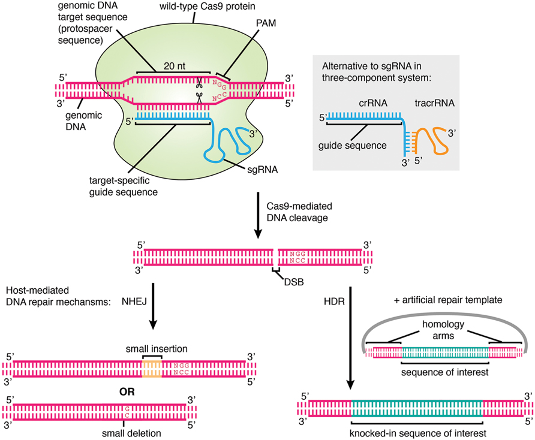

# Homework - Copy Number Variation and CRISPR
## Objectives

Using CRISPR library data supplied and Copy Number Variation (CNV) data of your choice, identify relationships between CNV and CRISPR guide RNA activity. This CRISPR library was conducted in the A375 melanoma cell line, so CNV and genotype information should be obtained for this cell line using published literature or cell line databases. The data source should be justified.

## Rules
This task is un-timed. You may use any programming language, libraries, or frameworks available to you provided they are available to others to reproduce your analysis. You should clearly distinguish your original code from 3rd party code. Clearly demonstrating your process and laying out your “thoughts in code” is more important than runtime performance. We must be able to re-create your analysis. Organisation counts and the ability to layout and document a source repository in a sensible way is part of the assignment. Formal unit testing is not required, but one should provide evidence their analysis was executed as intended and results are not due to errors like improper parameters.

## Instructions
For this repository, write one or more scripts to analyze the included guide_data.tsv file, then make a pull request back with your code and email getin@desktopgenetics.com with the subject “Homework Complete” including a summary of your results. You may also want to generate documents, makefiles, plots, figures, or other pieces of code to support your analysis or allow it to be reproduced by us.

In addition, you should then prepare a 30 minute presentation on your approach and findings for the Desktop Genetics team. 

In your analysis, consider the following topics:

1. From provided databases, annotate a .CSV file of choice while incorporating quality control checkpoints and method of alignment.

2.

3. Outline parameters for dataset analysis: SOP of process starting from reception of raw data file to final code, including timeline, resources, tools and thought process  

## A very basic CRISPR introduction
In CRISPR/Cas9 genome editing, a DNA cutting enzyme (nuclease) known as Cas9 is targeted toward a specific part(s) of the genome by encoding instructions in a nucleic acid sequence, known as a guide RNA. The nuclease is thought to search the genome by jumping to a random point and then linearly scanning for the pattern NGG before detaching and repeating the cycle at a new location. If the pattern NGG is found, the nuclease then checks the 20 character programmable pattern right to left. If the match is *sufficiently close*, typically fewer than 4 mismatches, then the nuclease will cut the genome at this location. Otherwise it will detach and try another location.

The host cell will then attempt to repair this cut with one of several different repair pathways each with a characteristic, at times imperfect, outcome. For example, if the genome is cut inside of functional region, a gene, this gene may be disabled if the repair is imperfect. If this gene is essential and imperfectly repaired, then the cell can die. By repeating this process in parallel millions of times with different guide sequences, we can use CRISPR to determine the genes a cell needs to survive. These genes are often good drug targets when the cell is a cancer cell.

When there are numerous copies of a single gene, the nuclease cannot differentiate between which is the right and wrong sequence to cut and therefore causes excess DNA cutting. We call this "off target effects" which means nucelase activity in multiple locations and there is a loss in specificty of the CRISPR cut. By identifying where these problematic regions in the genome exist, we can target around that region and therefore sidestep cutting errors.

## Sample of dataset

## Prior Art 

